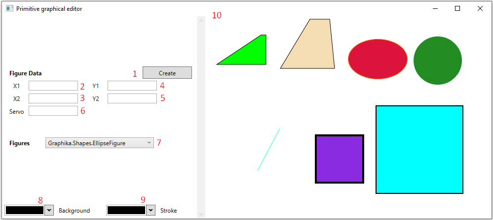

# Graphika
КСиС, ПОИТ, 851006, работа по ООП
<h2> Краткое пособие для работы </h2>

<ol>
  <li>Кнопка создания новой фигуры;</li>
  <li>Поле для ввода координаты X1 (преимущественно);</li>
  <li>Поле для ввода координаты X2 (преимущественно);</li>
  <li>Поле для ввода координаты Y1 (преимущественно);</li>
  <li>Поле для ввода координаты Y2 (преимущественно);</li>
  <li>Вспомогательное поле;</li>
  <li>Список фигур, доступных для прорисовки;</li>
  <li>Палитра заливки фигуры;</li>
  <li>Палитра обводки фигуры;</li>
  <li>Канвас.</li>
</ol>

<b>Ellipse</b>, <b>Rectangle</b> рисуются по одним и тем же правилам: для фигуры задается прямоугольная область прорисовки путем ввода двух координатных точек <b>(X1, Y1)</b> и <b>(X2, Y2)</b>. Начало системы координат - левый верхний угол канваса. Для удобства её можно перетащить, также возможно масштабирование. Поле <b>Servo</b> задает толщину обводки. 

Line рисуется согласно двум введенным координатным точкам <b>(X1, Y1)</b> и <b>(X2, Y2)</b>, причем её позиция будет соответствовать позиции реальной прямой в декартовой системе координат. Фигура создается в начале координат (левый верхний угол канваса). Для удобства её можно перетащить, масштабирование невозможно. Поле <b>Servo</b> задает толщину обводки. Задание фона путем выбора цвета в палитре <b>Backgrund</b> невозможно, так как фигура не имеет объема. Задание цвета осуществляется его выбором в палитре <b>Stroke</b>.

<b>Polygon</b> ограничен четырьмя углами, так что корректно будет называть его "четырехугольник". У фигуры горизонтальные стороны попарно параллельны. <b>X1</b> и <b>Y1</b> задают углы, образующие верхнюю сторону, <b>X2</b> и <b>Y2</b> - нижнюю. Для отображения корректного результата настоятельно рекомендуется вводить точки в следующем порядке: <b>X1</b>, <b>Y1</b>, <b>X2</b>, <b>Y2</b>. Поле <b>Servo</b> служит для задания высоты фигуры. Простейшие геометрические фигуры, которые можно нарисовать - прямоугольник, трапеция. Фигура создается в левом верхнем углу канваса. Позиционирование возможно, масштабирование - нет.
